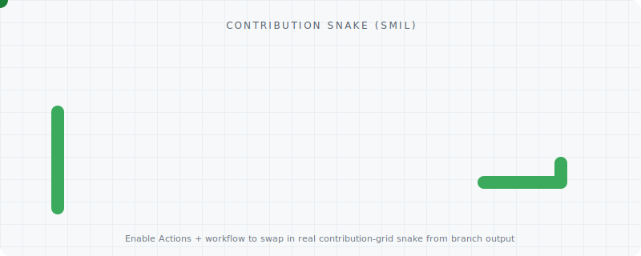

<!-- Profile README: use GitHub Release asset URLs (releases/download/...) — raw.githubusercontent.com often 404s through Camo on profile READMEs. Tag: readme-assets -->

  

  

  
  &nbsp;
  
  &nbsp;
  

---

## `▸` Who I am

I build **clear edges between domains** — APIs, persistence, auth, and UI — then harden every seam with observability and documentation.  
I care about **predictable deploys**, **honest error states**, and interfaces that respect the person on the other side of the screen.  
I do not ship features in isolation; I ship **systems you can reason about at 2am**.

---

## `▸` The loop

---

## `▸` Stack — spinning in orbit

  

---

## `▸` Signal strength

  

---

## `▸` Echo chase

  

---

## `▸` Landmarks

| | Project | Signal |
|:-:|:--------|:-------|
| ⛓️ | [**MediTrustChain**](https://github.com/PRAJWAL-BR-0304/MediTrustChain) | Blockchain-backed pharma supply chain · Next.js · Supabase · Flutter · Solidity |
| 🔄 | [**Habit Haven**](https://github.com/PRAJWAL-BR-0304/HabitTracker) | Mobile-first habit tracker · React · Vite · PWA — offline-first, installable |
| 🧠 | [**KnowBase**](https://github.com/PRAJWAL-BR-0304/KNOWLEDGE-BASE) | AI-assisted knowledge pages · Supabase · Groq · Vite |
| 📄 | [**PDF → Text**](https://github.com/PRAJWAL-BR-0304/pdf-to-text-converter) | Flask OCR pipeline · bulk extraction · export |
| 🏠 | [**DeFi-Homes**](https://github.com/PRAJWAL-BR-0304/DeFi-Homes) | Web3 real estate experiments · DeFi primitives |
| ✍️ | [**AI Grammar**](https://github.com/PRAJWAL-BR-0304/AI-GRAMMAR) | Language learning with explanations, not only corrections |
| 🎓 | [**Student Management**](https://github.com/PRAJWAL-BR-0304/Student-Management-System) | Academic workflows · RBAC · audit-friendly design |

  <a href="https://github.com/PRAJWAL-BR-0304?tab=repositories"><b>All repositories →</b></a>
  &nbsp;·&nbsp;
  <a href="https://github.com/PRAJWAL-BR-0304?tab=stars"><b>Stars →</b></a>

---

## `▸` Stats

  <picture>
    <source media="(prefers-color-scheme: dark)" srcset="https://github-stats-extended.vercel.app/api?username=PRAJWAL-BR-0304&show_icons=true&theme=tokyonight&hide_border=true&bg_color=0d1117&title_color=c4a6ff&icon_color=7ee787&text_color=8da3b8&rank_icon=github"/>
    
  </picture>
  &nbsp;
  <picture>
    <source media="(prefers-color-scheme: dark)" srcset="https://github-stats-extended.vercel.app/api/top-langs/?username=PRAJWAL-BR-0304&layout=compact&theme=tokyonight&hide_border=true&bg_color=0d1117&title_color=c4a6ff&text_color=8da3b8&langs_count=8"/>
    
  </picture>

  

---

## `▸` Activity

  

---

## `▸` Contribution grid (Platane)

  <picture>
    <source media="(prefers-color-scheme: dark)" srcset="https://raw.githubusercontent.com/PRAJWAL-BR-0304/PRAJWAL-BR-0304/output/github-contribution-grid-snake-dark.svg"/>
    <source media="(prefers-color-scheme: light)" srcset="https://raw.githubusercontent.com/PRAJWAL-BR-0304/PRAJWAL-BR-0304/output/github-contribution-grid-snake.svg"/>
    
  </picture>

---

## `▸` Contribution snake (SMIL)

  <picture>
    <source media="(prefers-color-scheme: dark)" srcset="assets/snake-dark.svg"/>
    <source media="(prefers-color-scheme: light)" srcset="assets/snake-light.svg"/>
    
  </picture>

---

## `▸` Connect

  
  
  
  
  
  

---

## `▸` Colophon

| Piece | Source |
|:------|:-------|
| Banner, orbit, skill bars, echo chase | **GitHub Release** [`readme-assets`](https://github.com/PRAJWAL-BR-0304/PRAJWAL-BR-0304/releases/tag/readme-assets) — `releases/download/readme-assets/*.svg` (same pattern as KNOWLEDGE-BASE / MediTrustChain; avoids `raw.githubusercontent.com` **404 via Camo**) |
| Typing line | [readme-typing-svg](https://github.com/DenverCoder1/readme-typing-svg) (demolab) |
| Stats & languages | [github-readme-stats](https://github.com/anuraghazra/github-readme-stats) |
| Streak | [github-readme-streak-stats](https://github.com/DenverCoder1/github-readme-streak-stats) — **demolab** mirror (Heroku mirror is often unavailable) |
| Activity graph | [github-readme-activity-graph](https://github.com/Ashutosh00710/github-readme-activity-graph) |
| SMIL snake | **Release** [`readme-assets`](https://github.com/PRAJWAL-BR-0304/PRAJWAL-BR-0304/releases/tag/readme-assets) — `snake-light.svg` / `snake-dark.svg` |
| Contribution grid (Platane) | **GitHub Actions** — [Platane/snk](https://github.com/Platane/snk); workflow uploads `github-contribution-grid-snake*.svg` to the **`readme-assets`** release and keeps **`output`** as a mirror. Workflow: `.github/workflows/generate-snake.yml` |

---

<i>Build something kind today.</i>

