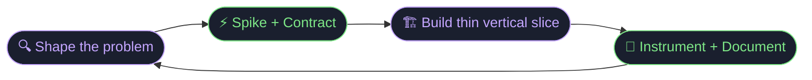

<!-- Profile README: use absolute raw.githubusercontent.com URLs (relative ./assets paths often break on github.com/username). Branch: main -->

  

  

  
  &nbsp;
  
  &nbsp;
  

---

## `▸` Who I am

I build **clear edges between domains** — APIs, persistence, auth, UI — then harden every seam with observability and documentation.
I care about **predictable deploys**, **honest error states**, and interfaces that respect the person on the other side of the screen.
I don't ship features. I ship systems that can be reasoned about at 2am.

---

## `▸` The loop

---

## `▸` Stack — spinning in orbit

  

---

## `▸` Signal strength

  

---

## `▸` Landmarks

| | Project | Signal |
|:-:|:--------|:-------|
| ⛓️ | [**MediTrustChain**](https://github.com/PRAJWAL-BR-0304/MediTrustChain) | Blockchain-backed pharma supply chain · Next.js · Supabase · Flutter · Solidity smart contracts |
| 🔄 | [**Habit Haven**](https://github.com/PRAJWAL-BR-0304/HabitTracker) | Mobile-first habit tracker · React · Vite · full PWA — works offline, installs to home screen |
| 🧠 | [**KnowBase**](https://github.com/PRAJWAL-BR-0304/KNOWLEDGE-BASE) | AI-powered knowledge pages · Supabase · Groq inference · Vite — your second brain, accelerated |
| 📄 | [**PDF → Text**](https://github.com/PRAJWAL-BR-0304/pdf-to-text-converter) | Flask OCR pipeline · bulk extraction · email export — documents become data |
| 🏠 | [**DeFi-Homes**](https://github.com/PRAJWAL-BR-0304/DeFi-Homes) | Web3 real estate experiments · DeFi primitives · on-chain ownership proofs |
| ✍️ | [**AI Grammar**](https://github.com/PRAJWAL-BR-0304/AI-GRAMMAR) | AI-assisted language learning — corrections that explain, not just correct |
| 🎓 | [**Student Management**](https://github.com/PRAJWAL-BR-0304/Student-Management-System) | Full-stack academic workflows · role-based access · clean audit trail |

  <a href="https://github.com/PRAJWAL-BR-0304?tab=repositories"><b>All repositories →</b></a>
  &nbsp;·&nbsp;
  <a href="https://github.com/PRAJWAL-BR-0304?tab=stars"><b>Stars →</b></a>

---

## `▸` Signals (always-on badges)

  
  
  
  
  
  

  

---

## `▸` Contribution calendar

  

---

## `▸` Echo Chase (built-in motion)

  

Repo-local <strong>SMIL</strong> animation (no JavaScript). Skill bars and orbit art use <strong>native SVG + SMIL</strong> so they still animate inside README <code>&lt;img&gt;</code>; GitHub strips <code>foreignObject</code> HTML and often ignores CSS <code>@keyframes</code> there.

---

## `▸` Contribution snake

  <picture>
    <source media="(prefers-color-scheme: dark)" srcset="https://raw.githubusercontent.com/PRAJWAL-BR-0304/PRAJWAL-BR-0304/main/assets/snake-dark.svg"/>
    
  </picture>

**Default:** SMIL snake above is served from **`main`** via absolute raw URLs so it shows on your **profile** (not only inside the repo). **Optional real grid snake:** enable **Actions**, set workflow permissions to **Read and write**, run **Generate Snake**, then point the `picture` block at the Platane SVGs on branch **`output`** if you prefer.

---

## `▸` Connect

  
  
  
  
  
  

---

## `▸` Colophon

- **Images:** `https://raw.githubusercontent.com/PRAJWAL-BR-0304/PRAJWAL-BR-0304/main/assets/...` (required for **profile** README). Skill bars use **SVG rects + SMIL**, not `foreignObject` HTML (GitHub README strips that).
- **Typing:** `readme-typing-svg.demolab.com` (animated server-side PNG/SVG).
- **Streak:** `github-readme-streak-stats.demolab.com` (Heroku mirror is often down).
- **Calendar:** `ghchart.rshah.org` SVG chart.
- **Echo Chase:** custom SMIL in-repo (reliable motion in README).
- **Snake:** SMIL `snake-*.svg` on `main` (same raw URL pattern). Optional Platane `snk` → **`output`** when Actions run.

---

<i>build something kind today.</i>

