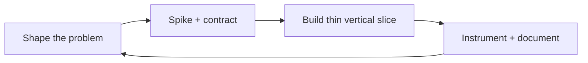

  

  

  
  
  

---

## ▸ Operating bias

I build **clear edges between domains** — APIs, persistence, auth, and UI — then harden the seams with observability and docs. I care about **predictable deploys**, **honest error states**, and interfaces that respect the person on the other side of the screen.

---

## ▸ Connect

---

## ▸ Stack I ship with

---

## ▸ Landmarks — repositories

| | |
|:---|:---|
| [**MediTrustChain**](https://github.com/PRAJWAL-BR-0304/MediTrustChain) | Blockchain-backed pharma supply chain · Next.js · Supabase · Flutter |
| [**Habit Haven**](https://github.com/PRAJWAL-BR-0304/HabitTracker) | Mobile-first habit tracker · React · Vite · PWA |
| [**KnowBase**](https://github.com/PRAJWAL-BR-0304/KNOWLEDGE-BASE) | AI knowledge pages · Supabase · Groq · Vite |
| [**PDF → Text**](https://github.com/PRAJWAL-BR-0304/pdf-to-text-converter) | Flask OCR pipeline · exports & email |
| [**DeFi-Homes**](https://github.com/PRAJWAL-BR-0304/DeFi-Homes) | Web3 / DeFi experiments |
| [**AI Grammar**](https://github.com/PRAJWAL-BR-0304/AI-GRAMMAR) | AI-assisted language learning |
| [**Student Management**](https://github.com/PRAJWAL-BR-0304/Student-Management-System) | Full-stack academic workflows |

<a href="https://github.com/PRAJWAL-BR-0304?tab=repositories"><b>All repositories →</b></a> · <a href="https://github.com/PRAJWAL-BR-0304?tab=stars"><b>Stars →</b></a>

---

## ▸ Loop (how work moves)

---

## ▸ Colophon

This profile uses a **repo-local SVG** banner (no third-party header image host), **shields.io** for counters, **komarev** for view counts, and **demolab** typing SVG — chosen after dropping widgets that often `503`/`404` (aggregated stats & trophies) so the page stays **quiet when services hiccup**.

---

Thanks for visiting — build something kind today.

